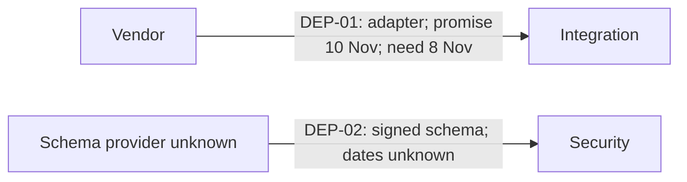

# Dependency coordination record

**Entire-project slip and critical path cannot be determined from these notes.** Durations, sequencing, calendars, constraints, and the integrated network are absent. The adapter has a **two-calendar-day local delivery gap**, not a proven two-day project delay.

Boundary: vendor → integration and schema provider → security. As-of date and year unspecified. November dates below are assumed to refer to the same month/year. Calendar-day subtraction is used; no working calendar was supplied. Proposed review cadence: daily until the gaps are resolved, and whenever scope, delivery dates, or acceptance changes.

| ID | Provider / accountable contact | Receiver / accountable contact | Deliverable / acceptance | Expected delivery | Needed by | Local margin | Status / evidence |
|---|---|---|---|---|---|---|---|
| DEP-01 | Vendor / unnamed | Integration team / unnamed | Usable adapter; retry behavior is required according to integration; full acceptance criteria unconfirmed | 10 Nov, vendor promise; reliability unvalidated | 8 Nov, integration requirement | 8−10 = **−2 calendar days** | Open timing and usability gap. Vendor reports draft sent “yesterday”; integration says retry behavior is missing. No receiver acceptance recorded |
| DEP-02 | Unknown / unassigned | Security team / unnamed | Signed schema; signing authority, schema version, and complete acceptance criteria unspecified | Unknown | Unknown | Unknown | Open, ownership and dates missing; evidence is the supplied security need |

This is a handoff map. Neither arrow is established as critical, and no relationship between the adapter and signed schema is evidenced.

| Gap | Proposed coordination action | Decision owner | Needed by | Impact to validate |
|---|---|---|---|---|
| DEP-01 timing | Ask vendor and integration to agree whether an acceptable staged adapter including retry behavior can arrive by 8 Nov; otherwise evaluate receiver resequencing and escalate the unresolved gap | Provider and receiver leads, names unknown; escalation authority unknown | Before 8 Nov if still upcoming; immediately if elapsed | Which integration tasks are blocked, their duration, alternatives, and effect on final milestone |
| DEP-01 acceptance | Integration lead to define testable retry and other acceptance criteria; vendor to confirm scope and delivery evidence | Both leads, unnamed | Before accepting any delivery | Whether the draft permits any safe work to start |
| DEP-02 | Coordination lead to assign provider and receiver contacts, identify signing authority, and obtain both dates | Unassigned | Unspecified; resolve at next coordination review | Security activities blocked and connection to release gates |
| Project-date claim | Obtain integrated tasks, durations, logic, baseline/forecast dates, calendars, and resource constraints, then analyze critical path and float | Schedule owner, unassigned | Before publishing an exact slip claim | Total project delay currently unknown |

## Change history

- Supplied notes, evidence date unspecified: vendor promises adapter 10 Nov; integration needs 8 Nov. No prior dates supplied.
- “Yesterday,” exact date unresolved: vendor says draft sent. Receiver reports missing retry behavior; draft is not an accepted handoff. Preserve this event when a corrected delivery is accepted.
- Security schema need recorded without dates or provider. Do not mark either dependency done until its receiver records acceptance.
