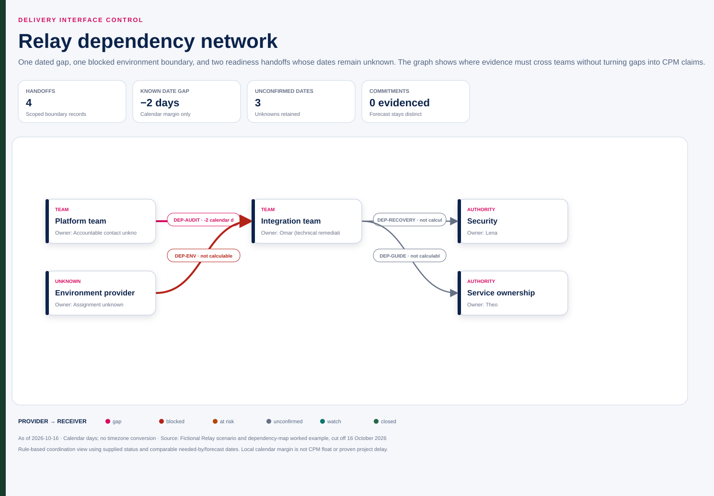

# Relay: audit interface handoff at 16 October

Fictional dependency record, as of 16 October 2026. The platform audit-event interface is forecast for 22 October while integration needs it on 20 October. The case supplies a forecast, not evidence of a binding provider commitment or a completed receiver agreement. Mina coordinates; Omar owns technical remediation.

| Field | Current record |
|---|---|
| Dependency | Audit-event interface into Relay integration; local ID DEP-AUDIT proposed for this artifact |
| Provider | Platform team; named accountable contact and commitment authority not supplied |
| Receiver | Integration team; Omar's technical role known, exact acceptance assignment to confirm |
| Usable boundary | Proposed: agreed schema/version, reachable test interface, representative event behavior and receiver validation evidence |
| Needed-by | 20 October; detailed receiving-activity/validation basis to confirm |
| Expected delivery | 22 October as known on 16 October |
| Provider commitment | Not supplied; do not relabel the forecast |
| Local margin | 20 − 22 = −2 calendar days |
| Actual delivery/acceptance | Not yet evidenced |

## Options and decisions

| Option | Benefit | Condition and limit |
|---|---|---|
| Earlier bounded contract/sample | Could enable some receiver preparation | Provider must confirm usefulness and timing; sample does not prove real integration |
| Resequence independent work | May reduce idle time | Need actual remaining network and capacity; no assumed finish recovery |
| Add qualified interface capacity | Could shorten provider/receiver work | Availability, skill and onboarding cost are unconfirmed |
| Escalate date/scope tradeoff | Obtains authority beyond local coordination | Present actual impact evidence; two-day local gap alone is insufficient |

Mina should reconcile date meanings and contacts with both sides; Omar should assess the consuming activities and technical options within his role. These proposed follow-ups do not claim new commitments. R-001 concerns possible incompatibility; I-001 concerns a currently unavailable environment. They can interact with this handoff, but are separate records and causes must not be assumed.

## Closure and repair

Keep the original forecast and any later revisions. Mark delivered when the defined output arrives, verified when applicable checks run, and accepted only when the actual receiver records that decision. An interface ZIP arriving on 22 October may still require validation before usable work starts.

**Repair:** “Platform is two days late, so the pilot slips two days” becomes “the known local margin is −2 calendar days; project impact awaits the integrated remaining-work and capacity model.”

## Interactive dependency companion

[Open the offline dependency explorer](assets/software.html) for the provider-to-receiver graph, DSM matrix, filters, selected handoff evidence, responsive register, browser-local dependency editing, undoable draft history, source/draft exports, visible-slice CSV and print/PDF view. The editor rejects self-links and unsupported commitment claims, keeps directed cycles visible for review, and leaves the supplied source files unchanged.

Downloads: [source JSON](assets/software-source.json), [normalized JSON](assets/software.json), [full CSV](assets/software.csv), and [static SVG](assets/software.svg). The additional environment, security and service-readiness arrows are explicitly scoped boundary records; their unknown dates and assignments remain visible rather than being invented.
