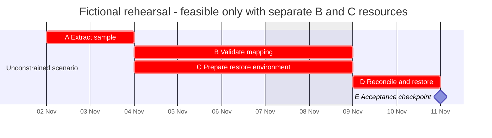
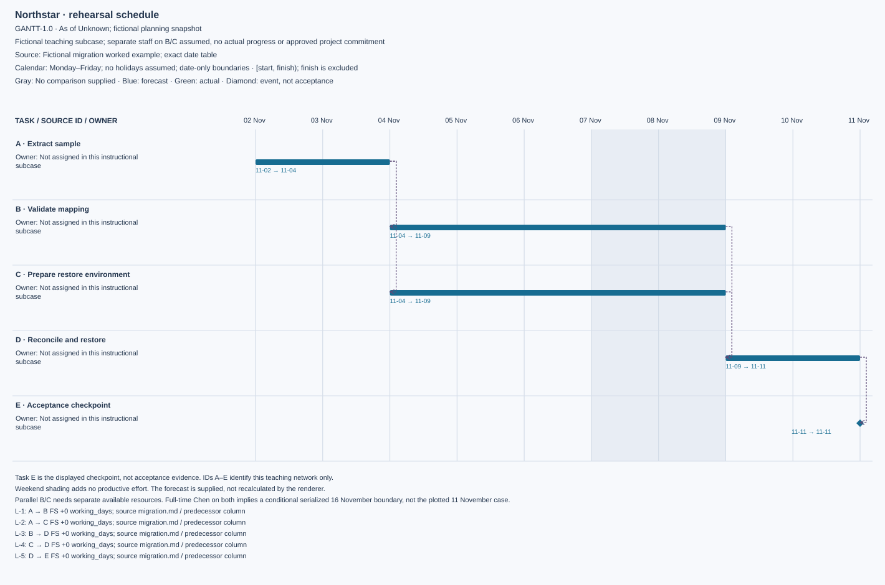

# Migration rehearsal: two tied branches

Open the **[interactive artifact](assets/migration.html)**, **[full editorial SVG](assets/migration.svg)**, [editable JSON](assets/migration-source.json), or [CSV](assets/migration.csv). The HTML runs offline in a browser; GitHub's file viewer may require downloading it first. It uses phase-grouped rows, a sticky date header and task pane, search/phase/owner filters, critical-only review, dependency toggles, selected-chain highlighting, zoom, visible-slice CSV, persistent evidence details, and a print/PDF layout. [Renderer instructions](../references/renderer.md) explain regeneration and supported behavior.

Fictional instructional subcase, not Northstar's approved cutover schedule or its actual rehearsal history. Additional assumptions: start Monday 2 November 2026; Monday–Friday workweek with no holidays; separate available resources for B and C; no external input delays. Finish dates below are exclusive boundaries.

| Task | Duration | Predecessors | Forecast start | Forecast finish | Model interpretation |
|---|---|---|---|---|---|
| A Extract sample | 2 working days | None | 2 Nov | 4 Nov | Critical |
| B Validate mapping | 3 | A | 4 Nov | 9 Nov | Critical branch 1 |
| C Prepare restore environment | 3 | A | 4 Nov | 9 Nov | Critical branch 2 |
| D Reconcile and restore | 2 | B and C | 9 Nov | 11 Nov | Critical join |
| E Acceptance checkpoint | 0 | D | 11 Nov | 11 Nov | Gate event, not evidence of acceptance |

[Editable Mermaid source](assets/migration.mmd).

The artifact separates the plotted seven-working-day parallel forecast from the conditional ten-working-day serialized scenario. The JSON records both critical paths and the resource assumption explicitly. The renderer displays that supplied analysis without promoting the 16 November boundary to an approved forecast or implying that the checkpoint proves acceptance.

B and C use explicit Monday finish boundaries to match the source table. Their productive dates remain 4–6 November; the shaded weekend adds no effort. The table preserves their dependency on A. Explicit dates must be recalculated when the schedule changes.

## Why the calendar matters

B and C each occupy 4, 5 and 6 November. The excluded weekend is not extra productive effort. D occupies 9 and 10 November, with E at the 11 November boundary. Both paths have seven working days. The zero-duration checkpoint does not imply that Saira's review needs no time: prepare and schedule review work separately when that effort and availability are known.

## Resource challenge

If Chen must work full-time on both B and C, their overlap is infeasible. A conditional serialized alternative takes A2+B3+C3+D2 = ten working days, ending at the 16 November boundary under the same calendar and full availability. That is a scenario, not an approved forecast: validate assignment, review lead time and actual external mapping first. If qualified separate capacity is confirmed, the seven-day parallel case may remain feasible.

## Decision and repair

Jules should obtain the actual B/C assignments and acceptance availability before promising a rehearsal date. Accelerating B alone does not improve the parallel finish because C remains critical. Do not hide the resource conflict by drawing an attractive seven-day bar or shift Northstar's separate approved Saturday cutover into this weekday-only diagram.
