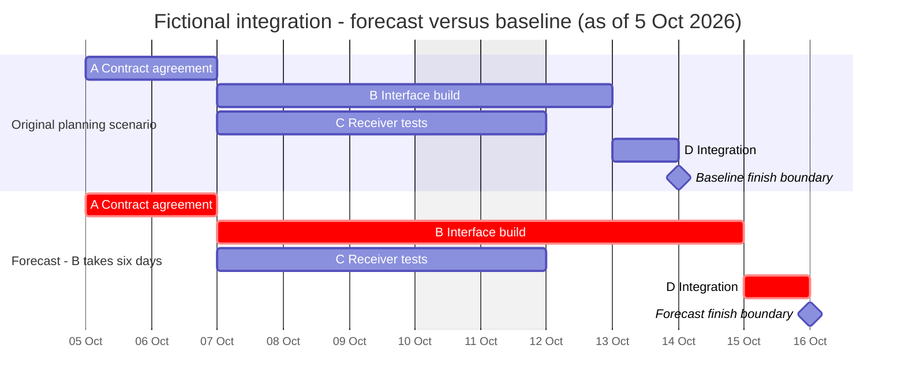
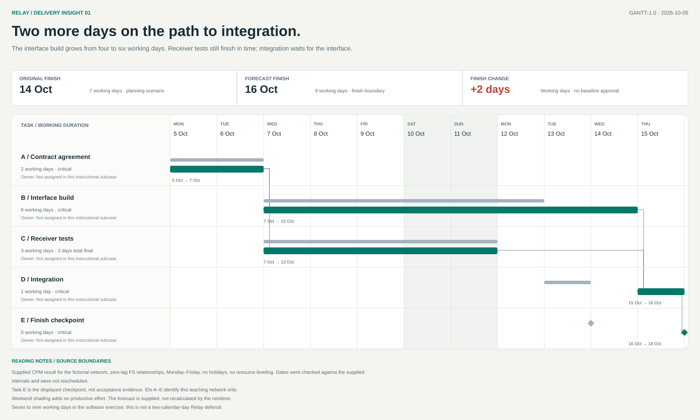

# Software integration: Gantt with baseline comparison

Open the **[interactive artifact](assets/software.html)**, **[full editorial SVG](assets/software.svg)**, [editable JSON](assets/software-source.json), or [CSV](assets/software.csv). The HTML runs offline in a browser; GitHub's file viewer may require downloading it first. It uses phase-grouped rows, a sticky date header and task pane, search/phase/owner filters, critical-only review, comparison and dependency toggles, selected-chain highlighting, zoom, persistent evidence details, a validated browser-local task editor, conflict diagnostics, history/undo/source restore, distinct source/full-draft/visible-draft exports, and a print/PDF layout. [Renderer instructions](../references/renderer.md) explain regeneration and supported behavior.

Fictional instructional subcase, not Relay's approved calendar baseline. Additional assumptions: start Monday 5 October 2026; Monday–Friday workweek; no holidays; full-time separate staff for parallel B and C. Dates are finish boundaries, not inclusive final work dates. The “baseline” below is only the original planning scenario for this exercise.

| Task | Predecessors | Original duration | Forecast duration | Original interval | Forecast interval |
|---|---|---|---|---|---|
| A Contract agreement | None | 2 working days | 2 | 5–7 Oct | 5–7 Oct |
| B Interface build | A | 4 | 6 | 7–13 Oct | 7–15 Oct |
| C Receiver tests | A | 3 | 3 | 7–12 Oct | 7–12 Oct |
| D Integration | B, C | 1 | 1 | 13–14 Oct | 15–16 Oct |
| Finish checkpoint | D | 0 | 0 | 14 Oct boundary | 16 Oct boundary |

[Editable Mermaid source](assets/software.mmd).

The artifact leads with the schedule decision: the original 14 October finish boundary moves to 16 October because B gains two working days. The JSON carries the presentation copy and the supplied CPM result separately from task dates, so the headline, critical IDs, and C's three days of total float remain inspectable claims rather than renderer guesses. The permanent SVG, JSON, and CSV downloads retain every source row. Local edits recalculate the axis, task bars, current-draft table, supported timing diagnostics and finish metrics while labeling the supplied CPM result for revalidation.

C uses an explicit Monday finish boundary so the rendered bar matches the table's next-working-boundary convention. Its three productive days remain Wednesday through Friday; the shaded weekend adds no effort. The table retains the dependency on A. Recalculate explicit dates when the underlying schedule changes.

## Arithmetic and interpretation

Original work on A occupies 5 and 6 October. B occupies 7, 8, 9 and 12 October, then D occupies 13 October; finish is the 14 October boundary. In the forecast, B also occupies 13 and 14 October, then D occupies 15 October; finish is the 16 October boundary. The network increases from seven to nine working days. A-B-D remains critical; C has additional float in the changed network.

This exercise contains no actual progress evidence, so no bar is labeled completed. It also contains no Relay pilot gates, holidays or real staffing approvals. Mina must not convert the two-working-day toy change into a two-calendar-day pilot deferral.

## Decision and repair

The visual makes the longer interface build visible while retaining the original comparison. The next decision is whether the actual project can change scope, sequence or resources, supported by its full remaining network. A shorter red bar drawn to meet 14 October would be an unsupported promise. Keep the 16 October forecast unless evidence justifies another sequence; obtain baseline approval separately.
