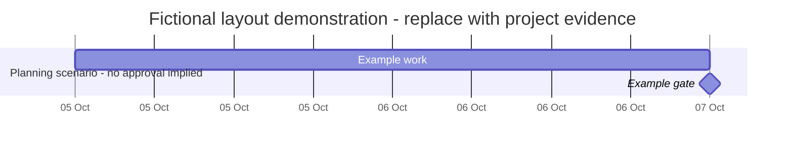

# Gantt source and review template

- Project / audience / version / as-of date:
- Purpose: planning scenario, baseline proposal, forecast review, or actual history:
- Baseline approval and source (or explicitly none):
- Calendar: workweek, holidays, time zone, task-specific exceptions:
- Finish convention: inclusive last work date or exclusive finish boundary:

| ID | Deliverable / task | Owner | Predecessors / relationship / lag | Duration / unit / basis | Baseline start | Baseline finish | Forecast start | Forecast finish | Actual start/finish and evidence | Status / unknowns |
|---|---|---|---|---|---|---|---|---|---|---|

## Chart

Replace the fictional demonstration below with supplied data; do not use these dates as project facts.

## Dependencies, resource conflicts and missing data

| Task / constraint | Evidence | Effect still to validate | Owner / action | Decision date or unknown |
|---|---|---|---|---|

## Variance and decision

State what moved, compared with which baseline, in working or calendar days, and whether change approval exists.

## Render review

Compare displayed starts/finishes to the source; inspect long labels, weekend events, milestone positions, legend, status claims and baseline/forecast distinction. Keep editable source with any exported visual.

## Visual delivery record

- Decision/audience and reason for this visual rather than a simpler alternative:
- Source file/system, field mapping, snapshot/filter coverage and missing data:
- Artifact mode: static, read-only inspection, or explicitly requested editing:
- Desktop, portrait and landscape reading path; essential values outside hover:
- Controls actually implemented and checked; selection/filter/reset behavior:
- Editable source and generated export paths; full versus current-view scope:
- Render dimensions/tool, source-to-mark checks, defects repaired and remaining limits:
