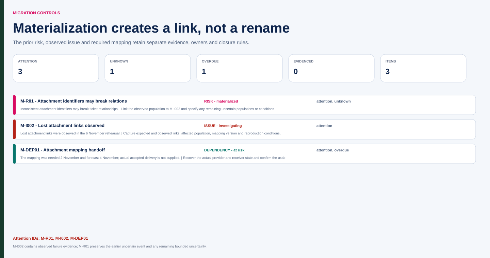

# Northstar attachment risk becomes an issue

Fictional training scenario, 6 November 2026. Current B1 comes from M-D001 on 5 October. The future M-CR02 approval on 9 November is not yet available. Existing IDs M-R01, M-I002 and M-DEP01 are preserved.

| ID / type | Evidence and current state | Response and authority | Closure / remaining uncertainty |
|---|---|---|---|
| M-R01 / risk | Earlier concern: inconsistent attachment identifiers may break ticket relationships. The rehearsal now reproduces missing links | Mark the observed event materialized and link M-I002; retain prior assessment and response record | Other populations/conditions may still carry uncertainty; specify them rather than declare all risk gone |
| M-I002 / issue | Lost attachment links observed in the 6 November rehearsal; exact count, configuration and evidence-file reference not supplied | Chen coordinates technical investigation; Beck's supplier action/commitment must be confirmed; Saira remains business acceptor | Corrected relationships demonstrated for the agreed population with applicable evidence and acceptance, or explicit authorized disposition |
| M-DEP01 / dependency | Mapping needed 2 November, forecast 4 November in the earlier record; actual accepted delivery not supplied | Recover actual provider/receiver state; do not assume the forecast became delivery | Receiver acceptance of specified mapping, distinct from downstream relationship correctness |

The issue record requests expected versus observed links, affected population, mapping/version and reproduction conditions. Equal source/target counts do not demonstrate correct attachment relationships. A supplier patch is a proposed correction, not a passing retest.

| History entry | What remains unchanged | What is added |
|---|---|---|
| Earlier M-R01 | Original cause/event/consequence and any documented assessment | No retroactive claim that failure was already observed |
| 6 November evidence | Risk ID and history | M-I002 observed failure and link from M-R01 |
| Future proposed repair | Failure evidence remains inspectable | Planned correction and retest, named commitments only when accepted |

No probability or fix date is supplied. A meeting mention of “Monday” would need attribution, intention and a clear date before becoming an accepted deadline. Jules can coordinate that clarification without being assigned the technical fix by default.

Escalation is needed if credible correction/retest and accepted scope cannot support the current baseline. Its exact decision window depends on remaining work and authority; do not claim a revised cutover or budget is already approved. M-CR02, if later evidenced, becomes a separate dated decision and prospective baseline update.

**Repair:** Renaming M-R01 “migration complete” when a patch arrives erases both the warning and failed rehearsal. Keep M-R01, M-I002 and the dependency linked, each with its own resolution evidence.

Open the [interactive RAID control workspace](assets/migration.html) to inspect the materialized-risk transition, current issue, dependency timing and later chronology without backdating it.

[Source JSON](assets/migration-source.json) · [normalized JSON](assets/migration.json) · [CSV RAID register](assets/migration.csv).
