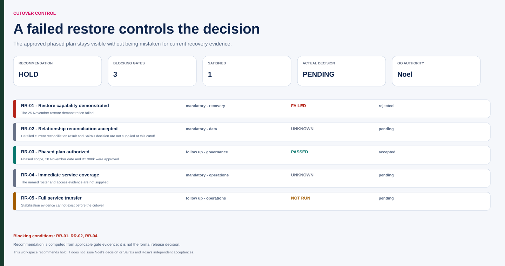

# Northstar readiness on 25 November

Fictional training scenario, 25 November 2026. M-CR02 established the phased plan, 28 November cutover and B2 300k on 9 November. Required reconciliation, restore and operational readiness remain in force.

**Recommend hold:** today's restore demonstration failed. The approved plan does not waive that condition. Actual technical findings, configuration and result-reference details need the source evidence; they are not invented here.

| Gate / control | Evidence at this cutoff | Decision implication |
|---|---|---|
| Restore capability | Demonstration failed 25 November | Correct, execute applicable retest and obtain required acceptance; no go basis from a document alone |
| Relationship reconciliation | Required for the agreed phased population; detailed current result not supplied | Counts alone cannot establish attachment correctness; retrieve applicable result and Saira's actual decision |
| Authorized plan | M-CR02 phased scope/date/funding | Comparison and authority boundary known; exact phase population must come from approved detail |
| Immediate service coverage | Required before cutover; named roster not supplied | Confirm access, monitoring, escalation and recovery decision ownership |
| Full service transfer | Rosa's post-cutover acceptance is a later transition | Set criteria now, verify stabilization before final transfer |

No blanket supplier “complete” statement can close these gates. Identify the correction owner, environment and receiver/reviewer capacity before promising a retest time. The last useful decision point depends on actual cutover and recovery constraints; 28 November by itself does not define that clock.

Recommend a current evidence review after correction, with Noel's actual go authority and independent acceptance roles preserved. If any conditional go is considered, require the actual policy and bounded exception authority; none is supplied for a failed restore.

Later evidence: successful rehearsal and Saira's acceptance occur 27 November; Noel's go supports 28 November cutover; Rosa accepts full operations handover on 2 December. Record each when it occurs. The known later outcome does not justify labeling the 25 November failed gate passed or asserting missing roster details.

**Repair:** “The sponsor approved the date, restore is optional” expands the decision beyond its scope. The corrected matrix preserves the gate and separates planning, readiness, go and transfer.

## Graphical companion

Open the [interactive release-readiness workspace](assets/migration.html) to inspect the failed restore, independent acceptance, immediate coverage and later chronology or create a validated browser-local draft.

[Source JSON](assets/migration-source.json) · [normalized JSON](assets/migration.json) · [CSV gate register](assets/migration.csv).
