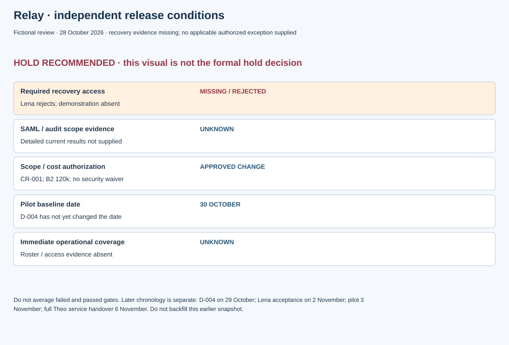

# Relay readiness on 28 October

Fictional training scenario, 28 October 2026. CR-001 already authorized optional-polish deferral and B2 funding. The approved pilot date remains 30 October at this cutoff; D-004 has not yet changed it.

**Recommend hold:** recovery-access demonstration is absent and Lena rejects readiness. No applicable authorized exception is supplied. This recommendation does not itself create a formal hold decision or a new baseline date.

| Condition | Current evidence and authority | Assessment / next evidence |
|---|---|---|
| Required recovery access | Demonstration absent; Lena's rejection recorded | Missing required proof; execute applicable demonstration and obtain actual security decision |
| SAML/audit and remaining required scope | Required boundary known; detailed current results not supplied here | Do not infer completion from coding or budget; retrieve applicable evidence |
| Scope/cost authorization | CR-001, 19 October; B2 120k, optional polish deferred | Approved planning change, not security waiver or go |
| Date | 30 October baseline | Feasible recovery/review sequence and actual date decision needed if it cannot hold |
| Immediate operational coverage | Must be explicit before pilot exposure | Current roster/access/escalation evidence absent in this review packet |
| Recovery limits and monitoring | Actual release plan details not supplied | Identify tested boundary, irreversible effects and decision triggers; no invented thresholds |

Mina coordinates the evidence gaps and schedule options. Lena's acceptance role is supplied; technical executor, review availability and exact demonstration criteria must come from actual records. Theo's later full service acceptance is separate from immediate release coverage. Do not demand post-pilot stabilization results today; establish their criteria and staffing now and collect results after execution.

Recheck on an applicable recovery result, material configuration change, changed population/window or new exception decision. A pass from another release would require explicit applicability review, not automatic reuse.

Later chronology stays separate: D-004 on 29 October defers the pilot to 3 November; Lena accepts security evidence on 2 November; pilot starts on 3 November; Theo accepts full service handover on 6 November. Those supplied outcomes do not fill missing underlying result/roster details in this earlier matrix.

**Repair:** “Go because coding and budget are complete” substitutes activity and funding for readiness. The corrected matrix names the missing independent condition and exact evidence/authority needed to change the recommendation.

## Graphical companion

[Editable source data](../assets/software-visual.json). The preceding tables and explanation remain the full accessible record; the graphic preserves their fictional scope and cutoff.
