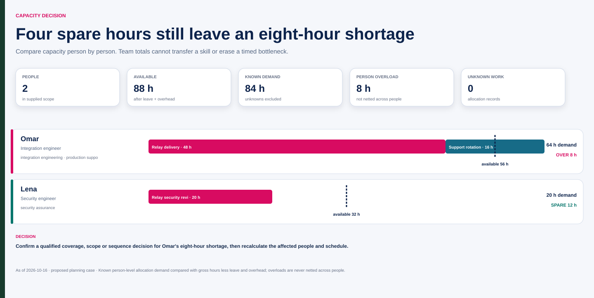

# Relay: four spare team hours do not solve an eight-hour shortage

Fictional capacity exercise for 19–30 October 2026. Hours are instructional inputs, not independently confirmed resource commitments. Support is an allocation; meetings/administration are overhead, so support is not deducted twice.

| Person | Gross | Leave | Overhead | Available | Relay demand | Support demand | Total demand | Remaining / overload |
|---|---:|---:|---:|---:|---:|---:|---:|---|
| Omar | 80 | 8 | 16 | 56 | 48 | 16 | 64 | −8; overload 8 |
| Lena | 40 | 0 | 8 | 32 | 20 | 0 in this explicitly bounded exercise | 20 | +12; overload 0 |
| Total | 120 | 8 | 24 | 88 | 68 | 16 | 84 | +4 aggregate, but Omar still overloaded |

Omar's modeled load is 64/56 ≈ 114.3%; Lena's is 20/32 = 62.5%. The aggregate 84/88 ≈ 95.5% does not establish feasibility. Lena's security expertise is not evidence of integration-engineering capacity. In a real record, an absent support assignment would remain unknown; this exercise explicitly supplies no additional Lena demand.

Run [the example input](assets/software-capacity.json):

```sh
python scripts/capacity.py --input examples/assets/software-capacity.json --format markdown
```

## Decision options

| Option | What it changes | Required confirmation |
|---|---|---|
| Transfer 8 support hours | Omar demand becomes 56 if a qualified colleague accepts those hours | Actual support owner/manager, competent coverage and timing |
| Defer 8 hours of eligible Relay work | Omar demand becomes 56 in this period | Scope/date impact and relevant authorization; mandatory acceptance cannot disappear |
| Add integration-capable help | May reduce Omar's work, but supervision can offset the gain | Named skill, access, availability and bounded task division |
| Resequence across periods | Moves demand to a later period | Real schedule flexibility and later capacity, not assumed float |

These are what-if scenarios, not decisions. Mina must resolve the actual constrained work and approving resource role. A balanced period still needs daily/window checks: if two tasks need Omar at the same time, total hours are insufficient evidence.

**Repair:** “The team has four spare hours, so the pilot is staffed” becomes “Omar is eight hours overloaded under the supplied case; twelve spare security hours do not establish a substitute. Confirm a specific scope, sequence or coverage decision.”

## Graphical companion

Open the [interactive capacity workspace](assets/software.html) to filter, inspect or create a validated browser-local draft. The source snapshot stays immutable and timing/skill evidence remains visibly separate from arithmetic.



[Source JSON](assets/software-source.json) · [normalized JSON](assets/software.json) · [CSV register](assets/software.csv). The preceding tables and explanation remain the accessible narrative; the rendered files preserve their fictional scope and cutoff.
