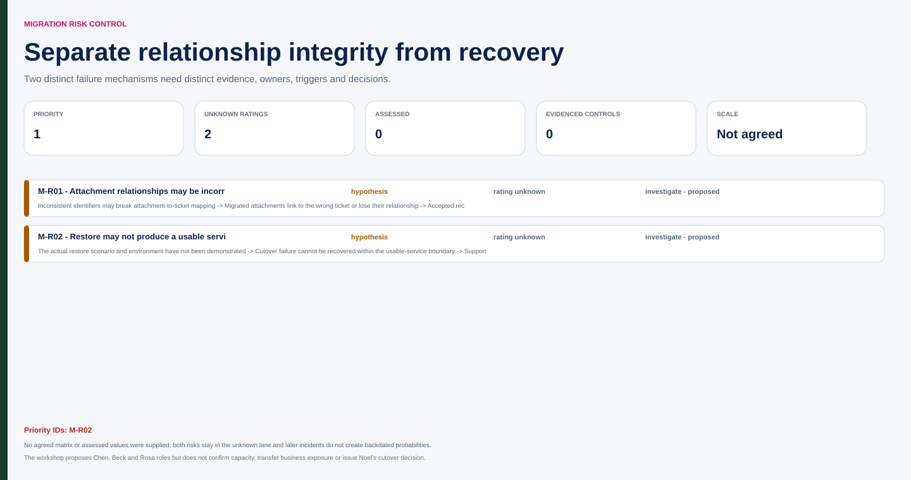

# Northstar risk review before rehearsal

Fictional training scenario, 23 October 2026, before the 6 November linkage issue and 25 November failed restore. B1 is still the 21 November cutover under M-D001. No later issue, scope change or acceptance is treated as known at this workshop.

**Mode:** guided, using supplied scope and roles. The first unanswered question asks what could make technically completed migration unusable. Chen proposes incorrect attachment-to-ticket relationships; Rosa proposes inability to restore after failure. The next question asks for actual controls and evidence. Population-wide linkage and restore proof are not supplied. Numerical probabilities and agreed matrix scales are also absent.

| Risk / objective | Assessment basis | Proposed response and effectiveness evidence | Residual decision |
|---|---|---|---|
| M-R01: inconsistent identifiers may break attachment relationships, undermining accepted usable records | Specific mechanism; current population-wide result unknown; not an observed failure yet | Chen with Beck investigates mapping and performs justified relationship checks; Saira reviews business evidence | Sampling/population uncertainty and exception rules need explicit treatment |
| Recoverability risk, ID unassigned: cutover failure may leave support without a usable service | Required recovery capability; demonstration absent | Define actual restore scenario/environment and execute it; Rosa contributes service requirements, technical performer/allocation to confirm | No demonstrated recovery or accepted residual exposure inferred |

1. **Recommend targeted evidence before commitment:** representative linkage checks plus a justified coverage strategy, and a separate restore demonstration. Count reconciliation can support completeness checks but cannot prove relationships or recovery.
2. **Recommend preventive correction when findings identify a mechanism:** assess changes and retest affected behavior. An assigned supplier investigation is not yet effective mitigation.
3. **Keep hold/replan available:** if required evidence is absent or failed at the decision point, escalate scope/date/sequence options. The latest useful decision time must come from actual remaining work and cutover commitments.
4. **Reject blanket transfer as a sufficient response:** Beck's supplier obligations, if confirmed, may allocate remediation work. They do not remove business disruption, Saira's acceptance or Noel's cutover decision.

The response record requests accepted owners, capacity, validation populations and review dates; none is manufactured by the facilitator. Triggers include reproduced relationship errors, failed restore, unavailable test inputs or a forecast that leaves no viable review window. These lead to distinct issues or decisions rather than one broad “migration risk” score.

Later evidence demonstrates why history matters: M-I002 on 6 November records actual lost links and links to M-R01; the 25 November restore failure is a different gate problem. Those later records update the control view without rewriting this earlier uncertainty.

**Repair:** “Vendor owns everything; green” loses both acceptance and contingency. Keep the two response mechanisms, current evidence gaps and actual decision boundaries visible.

## Graphical companion

Open the [interactive risk workshop](assets/migration.html) to inspect relationship and recovery mechanisms, response chains and later evidence without backdating it.

[Source JSON](assets/migration-source.json) · [normalized JSON](assets/migration.json) · [CSV risk register](assets/migration.csv).
