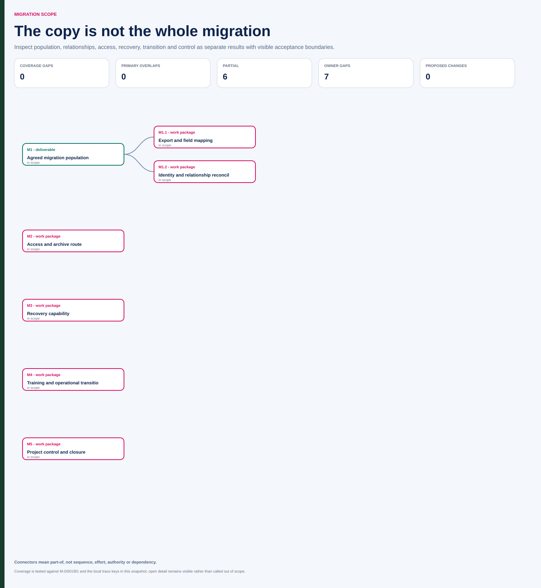

# Northstar: make migration boundaries reviewable

Fictional artifact as of 6 November 2026. M-D001 approved B1 on 5 October. M-I002 now records actual lost attachment links. This is a proposed decomposition of the agreed scope, not a new scope approval or an assertion that all assignments are confirmed.

| WBS ID | Package | Boundary and evidence | Role / open point |
|---|---|---|---|
| M1 | Agreed migration population | Active tickets and agreed attachments, with recorded inclusion/exclusion rules | Saira confirms business boundary; Chen prepares evidence |
| M1.1 | Export and field mapping | Versioned provider output and documented receiver expectations | Beck coordinates vendor side; receiving assignment to confirm |
| M1.2 | Identity and relationship reconciliation | Correct ticket/attachment relationships and explained exceptions, including M-REQ04 | Chen prepares; Saira accepts business result |
| M2 | Access and archive route | Applicable access mapping and usable archive access | Roles and detailed criteria to confirm |
| M3 | Recovery capability | Applicable restore procedure, demonstration and evidence | Chen technical preparation; Rosa service-readiness involvement |
| M4 | Training and operational transition | Support guidance, coverage and eventual accepted service transfer | Jules coordinates; Rosa receiving owner |
| M5 | Project control and closure | Decisions, cost reconciliation and accepted residual/benefit handoff | Jules; final authorities follow project governance |

## Dictionary: M1.2 Relationship reconciliation

Output: an evidence package showing that in-scope attachments remain associated with their correct tickets under the agreed matching rules. It includes the defined population, stable identities, relationship checks, explained exceptions and applicable result versions. File counts support coverage but do not prove relationships. The export is an input from M1.1; export creation is not estimated a second time within reconciliation.

M-I002 is an observed defect to correct and retest. The earlier M-R01 remains the historical risk record. This package does not silently expand into historical analytics redesign, which is excluded. Recovery is a separate M3 result; correct links do not prove restorability. Exact execution capacity and any vendor correction obligation require evidence rather than inference from this hierarchy.

## Planning handoff and decision

Pass these stable package boundaries into the remaining-work estimate and rehearsal sequence. If phasing is considered, specify which population and transition outputs change, including any duplicated operation or later work. On 6 November no M-CR02 approval yet exists; the 9 November decision must be recorded prospectively.

The coverage audit asks whether access, archive, support and project control are represented alongside data movement. The overlap audit asks where shared reconciliation, environment setup and supplier work are counted once. Both audits can expose gaps without claiming all uncertainty is resolved.

**Repair:** “Migration complete when the data copy ends” omits correctness, recoverability and receiving-service acceptance. The package model makes each of those a visible result with its own evidence.

Open the [interactive scope and WBS workspace](assets/migration.html) to inspect the nested population packages, package dictionaries, coverage audit, explicit exclusion and later change boundary.

[Source JSON](assets/migration-source.json) · [normalized JSON](assets/migration.json) · [CSV WBS register](assets/migration.csv).
