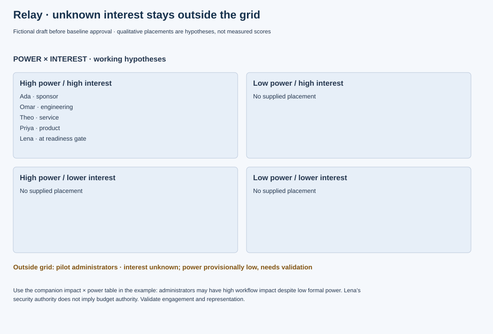

# Relay: two grids expose missing pilot voices

Fictional worked artifact, draft before baseline approval. The scenario supplies six roles but not measured interest or impact ratings; the placements below are explicit working hypotheses for validation. Added pilot administrators are a proposed affected group, not a supplied named participant.

| Stakeholder | Power and basis | Interest / impact hypothesis | Power × Interest | Impact × Power | Confidence |
|---|---|---|---|---|---|
| Ada, sponsor | High: baseline/funding mandate | High interest / medium-to-high accountability impact | Manage closely | High impact/high power if accountability exposure confirmed | Authority known; engagement level to validate |
| Omar, engineering lead | High influence over technical feasibility | High / high delivery workload | Manage closely | High impact/high power | Role known; allocation unknown |
| Lena, security lead | High within security acceptance | High at gate / medium daily workflow impact | Manage closely at readiness | Lower direct impact/high power for service workflow | Domain-specific power; do not generalize to budget |
| Theo, service owner | High within service acceptance | High / high ongoing responsibility | Manage closely | High impact/high power | Role known; current concerns to ask |
| Priya, product owner | High within backlog ordering | High / high outcome responsibility | Manage closely | High impact/high power | Separate from sponsor funding power |
| Pilot tenant administrators | Formal project power unknown, provisionally low | Interest unknown / likely high workflow impact | Unknown; do not choose Monitor from silence | High impact/low power hypothesis | Group needs identification and validation |

## Comparison that changes action

A power-only map would spend all available time with named leaders. The impact lens adds administrators who may experience changed login, recovery and support routes. Unknown interest is not low interest: lack of feedback may reflect lack of access to the team.

Propose that Priya identify representative administrators and arrange workflow/recovery feedback before the relevant acceptance review. That gives the group an evidence contribution; it does not assign them Lena's security authority or Theo's service authority. Mina should ensure their concerns appear in the acceptance and risk records, with an explicit response to each material issue.

| Action | Proposed owner | Evidence of useful engagement | Timing / state |
|---|---|---|---|
| Validate administrator representation and workflow impacts | Priya | Named representative, coverage gaps and agreed input route | Before criteria freeze; exact date unknown |
| Confirm Lena's review evidence and lead time | Mina with Lena | Agreed criteria and review availability | Before scheduling readiness; pending |
| Confirm service concerns and handover boundary | Mina with Theo | Documented operational acceptance needs | Planning review; pending |

**Repair:** “Administrators have no authority, so email them at launch” under-serves the group that lives with failure. Recruit their input early while preserving formal approval roles. Review the map after pilot scope, customer representation or organizational authority changes.

## Graphical companion

[Editable source data](../assets/software-visual.json). The preceding tables and explanation remain the full accessible record; the graphic preserves their fictional scope and cutoff.
